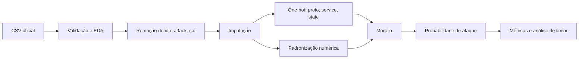

# Detecção de Intrusão no UNSW-NB15 com Redes Neurais Profundas

Projeto da disciplina **CCM-109 - Tópicos Especiais em Inteligência Artificial**, da Universidade Federal do ABC (UFABC).

**Autor:** Romulo Soares de Sousa  
**RA:** 21202510018  
**Professor:** Prof. Dr. Ronaldo Prati

> **Status:** estrutura inicial criada; estudo exploratório, baselines e DNN ainda devem ser executados com os dados oficiais.

## Visão geral

O projeto investiga a classificação binária de tráfego de rede em **normal** ou **ataque** usando o dataset público **UNSW-NB15**. A aplicação proposta é apoiar a priorização inicial de eventos e alertas em ambientes de SIEM/SOC, com atenção especial ao equilíbrio entre detecção de ataques e falsos positivos.

A comparação experimental será feita entre:

1. **Regressão logística**, como baseline linear;
2. **Random Forest**, como baseline não linear baseado em árvores;
3. **Deep Neural Network (DNN)** totalmente conectada, com ativações ReLU, dropout, saída binária e treinamento com Adam.

O estudo inicial e as decisões de escopo estão documentados em [`docs/estudo_inicial.md`](docs/estudo_inicial.md).

## Pergunta de pesquisa

> Uma rede neural profunda aplicada às características tabulares do UNSW-NB15 consegue melhorar a detecção de ataques em relação a baselines clássicos, sem produzir uma taxa excessiva de falsos positivos?

## Dataset

Fonte oficial: [The UNSW-NB15 Dataset - UNSW Research](https://research.unsw.edu.au/projects/unsw-nb15-dataset)

Este repositório usa os arquivos de partição disponibilizados pela própria base:

```text
UNSW_NB15_training-set.csv
UNSW_NB15_testing-set.csv
```

Os arquivos **não são versionados no Git**. Após baixá-los, coloque-os em:

```text
data/raw/
├── UNSW_NB15_training-set.csv
└── UNSW_NB15_testing-set.csv
```

Consulte [`data/README.md`](data/README.md) para detalhes.

## Pipeline planejado



### Cuidados metodológicos

- o pré-processador é ajustado **somente no treino**;
- o arquivo oficial de treino é dividido em treino e validação de forma estratificada;
- o arquivo oficial de teste permanece isolado até a avaliação final;
- `attack_cat` é removida da tarefa binária para evitar vazamento de informação;
- resultados são reportados com acurácia, precisão, recall, F1, ROC-AUC, PR-AUC, matriz de confusão e taxa de falsos positivos;
- o limiar padrão `0.5` é comparado a um limiar selecionado apenas na validação.

## Estrutura do repositório

```text
.
├── data/
│   ├── raw/                 # CSVs oficiais, ignorados pelo Git
│   └── processed/           # dados derivados, ignorados pelo Git
├── docs/
│   ├── estudo_inicial.md
│   ├── plano_experimental.md
│   └── diario_experimentos.md
├── notebooks/
│   └── 01_eda_unsw_nb15.ipynb
├── outputs/
│   ├── figures/
│   ├── metrics/
│   └── models/
├── report/
│   ├── README.md
│   └── references.bib
├── scripts/
│   └── init_github.ps1
├── src/
│   ├── constants.py
│   ├── data.py
│   ├── metrics.py
│   ├── train_baselines.py
│   └── train_dnn.py
└── tests/
    └── test_data.py
```

## Preparação do ambiente

### Windows PowerShell

```powershell
python -m venv .venv
.\.venv\Scripts\Activate.ps1
python -m pip install --upgrade pip
pip install -r requirements.txt
```

### Linux/macOS

```bash
python -m venv .venv
source .venv/bin/activate
python -m pip install --upgrade pip
pip install -r requirements.txt
```

## Publicação no GitHub

As instruções para criar o repositório, fazer o primeiro commit e enviar para o GitHub estão em [`docs/github_setup.md`](docs/github_setup.md). Durante o desenvolvimento acadêmico, a opção mais segura é mantê-lo privado até a entrega ou até receber orientação diferente do professor.

## Como executar

### 1. Validar dados e executar o estudo exploratório

```bash
jupyter lab notebooks/01_eda_unsw_nb15.ipynb
```

### 2. Treinar os baselines

```bash
python -m src.train_baselines --data-dir data/raw
```

Para executar somente a regressão logística:

```bash
python -m src.train_baselines --data-dir data/raw --models logistic
```

### 3. Treinar a DNN

```bash
python -m src.train_dnn --data-dir data/raw --epochs 100 --batch-size 512
```

A execução detecta automaticamente CUDA, MPS ou CPU.

### 4. Executar testes

```bash
pytest -q
```

## Saídas geradas

Os scripts criam arquivos em `outputs/`:

- `metrics/*.json`: métricas de validação e teste;
- `figures/*.png`: matriz de confusão, curva ROC e curva Precision-Recall;
- `models/*.joblib`: pré-processadores e modelos clássicos;
- `models/*.pt`: pesos da DNN;
- `metrics/dnn_history.csv`: histórico de treino e validação.

## Experimentos previstos

| ID | Modelo | Configuração | Objetivo |
|---|---|---|---|
| E00 | Dummy majoritário | Classe mais frequente | Referência mínima |
| E01 | Regressão logística | `class_weight=balanced` | Baseline linear |
| E02 | Random Forest | pesos balanceados | Baseline não linear |
| E03 | DNN | 128-64, dropout | Modelo principal |
| E04 | DNN | ajuste de largura/dropout | Ablation e tuning |
| E05 | Melhor modelo | ajuste de limiar | Reduzir falsos positivos |

Registre cada execução em [`docs/diario_experimentos.md`](docs/diario_experimentos.md), inclusive tentativas que não funcionarem.

## Reprodutibilidade

- semente padrão: `42`;
- versões de dependências declaradas em `requirements.txt`;
- dados brutos preservados fora do versionamento;
- artefatos e métricas salvos por modelo;
- protocolo de validação descrito em [`docs/plano_experimental.md`](docs/plano_experimental.md).

## Referências principais

- N. Moustafa e J. Slay. *UNSW-NB15: a comprehensive data set for network intrusion detection systems*. MilCIS, 2015.
- N. Moustafa e J. Slay. *The evaluation of Network Anomaly Detection Systems: Statistical analysis of the UNSW-NB15 data set and the comparison with the KDD99 data set*. Information Security Journal, 2016.

As entradas BibTeX iniciais estão em [`report/references.bib`](report/references.bib).

## Observação acadêmica

O código deste repositório é uma base de trabalho. Resultados, interpretações, limitações e decisões finais devem refletir os experimentos efetivamente executados e ser descritos de forma transparente no relatório.
